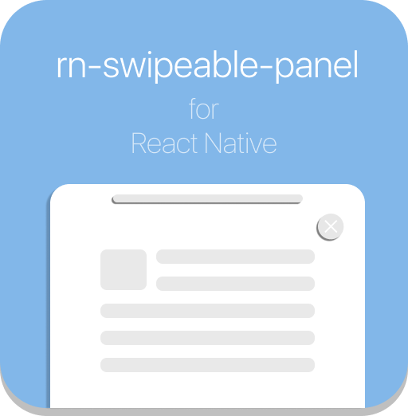

<div align="center" style="margin-bottom:1em">
    
</div>

<br/>

<div align="center" style="display:flex; justify-content:center;">
  
  <div>
    <h2>React Native Swipeable Panel<h2>
    <p>Swipeable, easy to use bottom panel for React Native</p>

[](https://www.npmjs.com/package/rn-swipeable-panel)

  </div>
</div>

<br/>

React Native Swipeable Panel that animate from bottom and controllable with pan gestures. You can extend panel by swiping up, make it small or close by swiping down with pan gestures. Feel free to redesign inside of the panel

## ⚙️ Installation

```
$ npm install rn-swipeable-panel --save
```

or

```
$ yarn add rn-swipeable-panel
```

<!-- ## Usage -->

## 🚀 How to use

```javascript
import React from "react";
import { StyleSheet, Text, View } from "react-native";

import SwipeablePanel from "rn-swipeable-panel";

export default class App extends Component {
  constructor(props) {
    super(props);
    this.state = {
      swipeablePanelActive: false
    };
  }

  componentDidMount = () => {
    this.openPanel();
  };

  openPanel = () => {
    this.setState({ swipeablePanelActive: true });
  };

  closePanel = () => {
    this.setState({ swipeablePanelActive: false });
  };

  render() {
    return (
      <View style={styles.container}>
        <Text style={styles.welcome}>Welcome to React Native!</Text>
        <Text style={styles.instructions}>To get started, edit App.js</Text>
        <SwipeablePanel
          fullWidth
          isActive={this.state.swipeablePanelActive}
          onClose={this.closePanel}
          onPressCloseButton={this.closePanel}
        >
          <PanelContent /> {/* Your Content Here */}
        </SwipeablePanel>
      </View>
    );
  }
}
```

## ☝️ Options

<br/>

| Properties              | Type       | Description                                              | Default |
| ----------------------- | ---------- | -------------------------------------------------------- | ------- |
| **isActive**            | `bool`     | Show/Hide the panel                                      | `false` |
| **onClose**             | `Function` | Fired when the panel is closed                           |         |
| **showCloseButton**     | `bool`     | Set true if you want to show close button                |         |
| **fullWidth**           | `bool`     | Set true if you want to make full with panel             | `false` |
| **openLarge**           | `bool`     | Set true if you want to open panel large by default      | `false` |
| **onlyLarge**           | `bool`     | Set true if you want to let panel open just large mode   | `false` |
| **noBackgroundOpacity** | `bool`     | Set true if you want to disable black background opacity | `false` |
| **style**               | `Object`   | Use this prop to override panel style                    | `{}`    |
| **closeRootStyle**      | `Object`   | Use this prop to override close button background style  | `{}`    |
| **closeIconStyle**      | `Object`   | Use this prop to override close button icon style        | `{}`    |
| **closeOnTouchOutside** | `bool`     | Set true if you want to close panel by touching outside  | `false` |

#### ⭐️ Show Your Support

Please give a ⭐️ if this project helped you!

#### 👏 Contributing

If you have any questions or requests or want to contribute to `rn-swipeable-panel`, please write the [issue](https://github.com/enesozturk/rn-swipeable-panel/issues) or give me a Pull Request freely.
